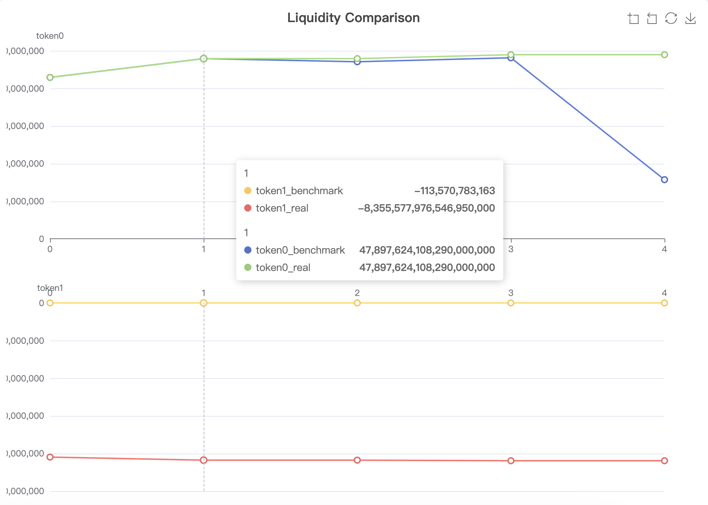

# Backtest Benchmark for Uniswap LPs

## Idea

One of the core reasons to propose Uniswap Hooks is to enable devs to easily implement their own LP strategy.
This raises the requirements for a *backtest* tool so they can compare their LP strategy with others using *real-world* swap dataset to know the pros and cons, and to really make it profitable.

## Features

- Easy integration: no needs to change the tested Hook
- Simple testing: just run backtest with `forge test`
- Quick and customizable test data collection: just get them from TheGraph following the instructions below

## Design


## Implementation

- [CounterBacktest.sol](./contracts/src/CounterBacktest.sol) implements a sample wrapper over the to-test hook contract so you can inject any logic during benchmarking;
- [DeployHook.s.sol](./contracts/script/DeployHook.s.sol) shows how to deploy wrapped hooks: since Uniswap uses `CREATE2` to determine the contract address, both the to-test hook and backtest hook's addresses need to be determined in advance;
- [CounterBacktest.t.sol](./contracts/test//CounterBacktest.t.sol) the unit-test driver that really runs the backtest;
- To collect the real-world historical swaps, you can use [Uniswap v3 Ethereum](https://thegraph.com/explorer/subgraphs/ELUcwgpm14LKPLrBRuVvPvNKHQ9HvwmtKgKSH6123cr7?chain=mainnet) subgraph and the following GraphQL
```graphql
{
   swaps(orderBy: timestamp, orderDirection: desc, where:
   { pool_in: ["0x11b815efb8f581194ae79006d24e0d814b7697f6"] }
) {
      id,
   hash,
   pool {
      id,
      name,
      symbol
      },
   tokenIn {
      id,
      name,
      symbol
      },
   tokenOut {
      id,
      name,
      symbol
      },
   amountIn,
   amountOut
   }
}
```

## Output

The unit-test will log the liquidity changes like


Then you can easily visualize it with [online tool](https://echarts.apache.org/en/index.html).



# scaffold-hook

_Develop and test Uniswap v4 Hooks with minimal interfaces for the swap lifecycle (pool creation, liquidity provision, and swapping)_

> _inspired by [scaffold-eth](https://github.com/scaffold-eth/scaffold-eth-2)_

## Features

✅ Template hook with deployment commands

✅ User interfaces for: pool creation, liquidity creation, and swapping

✅ Local network (anvil) with predeployed Uniswap v4

✅ Testnet support

✅ Foundry (hardhat support coming later)

---

# Setup

_requires [foundry](https://book.getfoundry.sh/getting-started/installation) & [node 18+](https://nodejs.org/en/download)_

## Linux / WSL2 (TSTORE)

Please update [foundry.toml](foundry.toml#L9) to use the linux `solc`

Mac users do not need to change anything by default

## Install Dependencies

```bash
forge install

cd nextjs/
npm install
```

## Define environment variables

```bash
cp .env.example .env
```

See [Environment](#environment-variables) additional setup

---

## Get Started

1. Start the local network, with v4 contracts predeployed

   ```bash
   # root of the repository
   cd scaffold-hook/
   npm run anvil
   ```

2. Deploy the template hook

   ```bash
   # root of the repository
   cd scaffold-hook/
   forge build
   npm run deploy:anvil
   ```

3. Update [wagmi.config.ts](nextjs/wagmi.config.ts) with the hook address from [run-latest.json](/broadcast/DeployHook.s.sol/31337/run-latest.json)

4. Regenerate react hooks, addresses, and ABIs

   ```bash
   cd nextjs/
   npm run wagmi
   ```

5. Start the webapp
   ```bash
   cd nextjs/
   npm run dev
   ```

## Hook Configuration

Modifying the file name, contract name, or _hook flags_ will require configuration:

Renaming -- update [.env](.env)

```bash
# Hook Contract, formatted: <filename.sol>:<contractName>
HOOK_CONTRACT="Counter.sol:Counter"
```

Changing hook flags -- update [.env](.env) and ensure `getHookCalls()` is in agreement

```bash
# in .env
# Hook Flags
BEFORE_SWAP=true
AFTER_SWAP=true
BEFORE_MODIFY_POSITION=true
AFTER_MODIFY_POSITION=true
BEFORE_INITIALIZE=false
AFTER_INITIALIZE=false
BEFORE_DONATE=false
AFTER_DONATE=false
```

```solidity
// in Hook Contract
function getHooksCalls() public pure returns (Hooks.Calls memory) {
    return Hooks.Calls({
        beforeInitialize: false,
        afterInitialize: false,
        beforeModifyPosition: true,
        afterModifyPosition: true,
        beforeSwap: true,
        afterSwap: true,
        beforeDonate: false,
        afterDonate: false
    });
}
```

## Deploying to Testnets

_Ensure your wallet is funded with testnet gas (ETH)_

- `npm run deploy:anvil`

- `npm run deploy:goerli`

- `npm run deploy:arbitrum-goerli`

- `npm run deploy:arbitrum-sepolia`

- `npm run deploy:optimism-goerli`

- `npm run deploy:base-goerli`

- `npm run deploy:sepolia`

- `npm run deploy:scroll-sepolia`

- `npm run deploy:polygon-mumbai`

- `npm run deploy:polygon-zkevm-testnet`

## Additional Configuration

### Custom Tokens

While `scaffold-hook` ships solmate's `MockERC20` on local and testnet, you can provide your own custom tokens:

1. define them in [wagmi.config.ts](nextjs/wagmi.config.ts#L80), and regenerate the codegen: `npm run wagmi`
2. import the generated addresses and edit [`TOKEN_ADDRESSES`](nextjs/utils/config.ts)

### Debuggable Hook (etherscan-style contract interface)

1. define the hook in [wagmi.config.ts](nextjs/wagmi.config.ts#L15), and regenerate the codegen: `npm run wagmi`
2. import the generated types and edit [`DEBUGGABLE_ADDRESSES`](nextjs/utils/config.ts)

## Environment Variables

- `ANVIL_FORK_URL`: RPC URL for anvil fork mode
- `ETHERSCAN_API_KEY`: Your Etherscan API Key
- `FORGE_PRIVATE_KEY`: The private key of the wallet for testnet deployments

# Learn more

To learn more about [Next.js](https://nextjs.org), [Foundry](https://book.getfoundry.sh/) or [wagmi](https://wagmi.sh), check out the following resources:

- [Foundry Documentation](https://book.getfoundry.sh/) – learn more about the Foundry stack (Anvil, Forge, etc).
- [wagmi Documentation](https://wagmi.sh) – learn about wagmi Hooks and API.
- [wagmi Examples](https://wagmi.sh/examples/connect-wallet) – a suite of simple examples using wagmi.
- [@wagmi/cli Documentation](https://wagmi.sh/cli) – learn more about the wagmi CLI.
- [Next.js Documentation](https://nextjs.org/docs) learn about Next.js features and API.
- [Learn Next.js](https://nextjs.org/learn) - an interactive Next.js tutorial.
